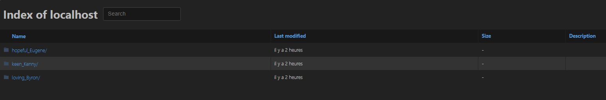

# maze

## Découverte

Dès l'arrivée sur le site, nous pouvons remarquer que 3 liens sont accessibles :



Si l'on test les trois liens, nous pouvons nous rendre compte que c'est une sorte de labyrinthe où nous devons trouver le bon dossier qui nous permet d'aller le plus loin possible dans l'arborescence.

Tree :

```bash
├── dir1
│   ├── dir1-1
│   │   ├── dir1-1-1
│   │       └──Knuth_notes.txt
│   │   ├── dir1-1-2
│   │       └──Knuth_notes.txt
│   │   └── dir1-1-3
│   │           ├── dir1
│   │           ├── dir2
│   │           └── dir3
│   ├── dir1-2
│   │   ├── dir1-2-1
│   │       └──Knuth_notes.txt
│   │   ├── dir1-2-2
│   │       └──Knuth_notes.txt
│   │   └── dir1-2-3
│   │       └──Knuth_notes.txt
│   ├── dir1-3
│   │   ├── dir1-3-1
│   │       └──Knuth_notes.txt
│   │   ├── dir1-3-2
│   │       └──Knuth_notes.txt
│   │   └── dir1-3-3
│   │       └──Knuth_notes.txt
├── dir2
│   ├── dir2-1
│   │   ├── dir2-1-1
│   │       └──Knuth_notes.txt
│   │   ├── dir2-1-2
│   │       └──Knuth_notes.txt
│   │   └── dir2-1-3
│   │       └──Knuth_notes.txt
│   ├── dir2-2
│   │   ├── dir2-2-1
│   │       └──Knuth_notes.txt
│   │   ├── dir2-2-2
│   │       └──Knuth_notes.txt
│   │   └── dir2-2-3
│   │       └──Knuth_notes.txt
│   ├── dir2-3
│   │   ├── dir2-3-1
│   │       └──Knuth_notes.txt
│   │   ├── dir2-3-2
│   │       └──Knuth_notes.txt
│   │   └── dir2-3-3
│   │       └──Knuth_notes.txt
├── dir3
│   ├── dir3-1
│   │   ├── dir3-1-1
│   │       └──Knuth_notes.txt
│   │   ├── dir3-1-2
│   │       └──Knuth_notes.txt
│   │   └── dir3-1-3
│   │       └──Knuth_notes.txt
│   ├── dir3-2
│   │   ├── dir3-2-1
│   │       └──Knuth_notes.txt
│   │   ├── dir3-2-2
│   │       └──Knuth_notes.txt
│   │   └── dir3-2-3
│   │       └──Knuth_notes.txt
│   └── dir3-3
│       ├── dir3-3-1
│   │       └──Knuth_notes.txt
│       ├── dir3-3-2
│   │       └──Knuth_notes.txt
│       └── dir3-3-3
│   │       └──Knuth_notes.txt
```
## Problème numéro 1 : Lien symbolique

Certains choix d'url dans l'arborescence redirige l'utilisateur vers un lien déjà passé. Il faudra donc en tenir compte lors de la résolution du challenge. 

## Problème numéro 2 : Suprise, le flag final n'est pas à la fin de l'arborescence

En effet, à la fin de l'arborescence se trouve la fin du flag. Nous pouvons retrouver son contenu en utilisant par exemple la fonction python `binascii.unhexlify(flag)`

Soit :

`binascii.unhexlify("75305433737d")` qui donne `b'u0T3s}'` ce qui ressemble bel et bien à la fin du flag.

Ce bout de flag figure dans un fichier `flag.txt` ce qui signifie qu'il est nécessaire de requêter chaque arborescence dans son intégralité jusqu'à découvrir tous les flag.txt. 

Ces fichiers ne sont pas numérotés, il faut les assembler dans l'ordre selon lequel nous allons les rencontrer. 

## Utiliser le script de solve

Remplacer l'ip et le port dans solve.py à la ligne : `xget("http://127.0.0.1:1234", liste)`

`python3 solve.py`

L'execution du script dure une dizaine de secondes.

`b'FLAG{did_u_like_my_Knuth_Qu0T3s}'`

## Flag

FLAG{md5(did_u_like_my_Knuth_Qu0T3s)} == FLAG{cbccd12520bef9ebc964aa140ad70a13}
