# Pro0fError | ECW 2023 Misc | Medium/Hard

## Scenario

In this scenario :

- The "student" will be a reference to the player.
- The "paper" will be a reference to the QR Code.
- The "mask" will be a reference to the QR Code mask.

"Your professor always introduces errors in your paper's correction where you were totally right".
--> QRCode Error Correction but they override some correct letters from the flag

"Your professor always hides easter eggs at the very end of your papers.".
--> Hidden message after the "end of data". Uses padding ("pudding") bits to hide additional data.

"Your professor always gives your papers back with a little colored mask based on your grade".
--> Custom mask to take off from the "paper" to reveal the raw/real message containing the flag.

## Description

The other day when cleaning my room, I found my very old personal diary from college.

Alongside with my diary I found a paper from my college's year wrapped in a super old gift paper. I couldn't even distinguish the pattern on it.

Can you help me recover my perfect original work ?
Please be careful when taking off the Elon's mask, the corners are particularly fragile...

## Attachments

- diary.md (Diary page with rules)
- paper.png (Corrected Paper)
- grading-scale.png (Grid with grade / mask pattern matching)

## Introduction

The first thing to think of is basically to scan the QR Code as is. However, something seems off...
After a few minutes trying to scan the QRCode using our best known photo shoot angles, we have to accept that this will not scan.

To continue, we need to understand how a QR Code works and how QR scanners manage to extract and interpret data from simple black and white pixels.

This write-up will not be a full course about QR Codes, readers are supposed to have basic understandings regarding how QR Codes work.

There is an [excellent website](https://www.thonky.com/qr-code-tutorial/) that regroups detailed and complete information about how QRCodes work. This will be our main source of understanding during this write-up.

## The Mask

### Grey pixels ?

When looking at the QR Code `paper.png`, we notice that there are some **grey pixels** around certain corners. These grey pixels are suspicious.

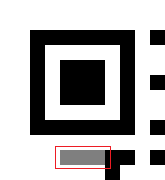

Based on the format information diagram below, they seem to indicate the **mask pattern**.

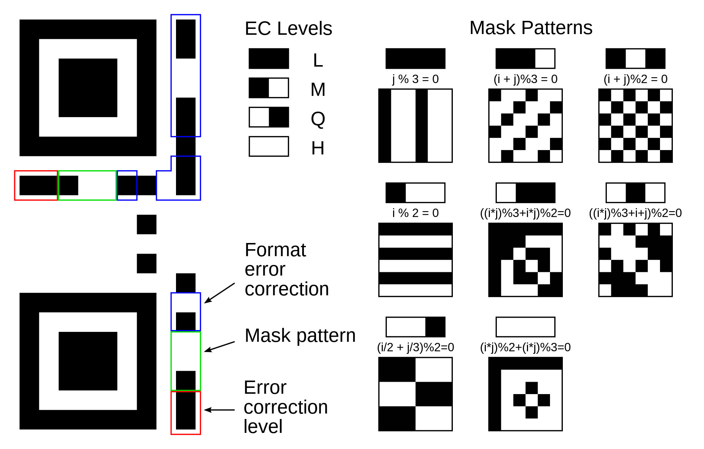

The mask pattern indicator is represented on **3 bits** for the 8 different masks patterns, which makes sense.

### First rule

The **first rule** introduced in the challenge description is the following :

```text
He would always wrap student's homework in wrapping paper with weird patterns before handing them. He liked to call it the Elon's mask. 
```

If we disregard the pun about the former X's CEO, we understand that the teacher "covers" the papers with a "mask" before giving it back to the students.

Wikipedia says the following about QR Code masks :

```text
Masking is used to break up patterns in the data area that might confuse a scanner, such as large blank areas or misleading features that look like the locator marks. The mask patterns are defined on a grid that is repeated as necessary to cover the whole symbol. Modules corresponding to the dark areas of the mask are inverted.
```

So basically, a mask is applied onto QR Codes after the data are embedded, and **each dark pixel of the mask inverts the color of the corresponding QRCode pixel**.
To retrieve the original data, QR Code readers first have to **cancel out** the mask.

### Finding the correct mask

From the description :

```text
[Masks] patterns were based on the paper grade [...]
```

As we have seen earlier, there are **8 different patterns** for QR Codes, but our `Grading Scale` below contains **10 patterns**, which is suspicious.

According to the description, we got a **14/20** on this paper.
Based on the `grading scale`, this should be the mask applied to our "paper":

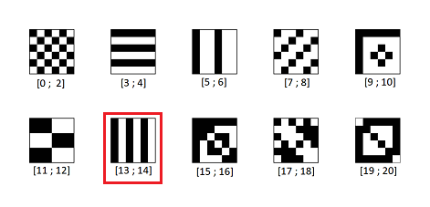

Of course, it is not part of the 8 known mask patterns.

This explains why the format information bits were greyed out : **this "custom mask" can not be represented using the 3 bits allowed for version information**.

What can we do now ?

### Remove the mask

Applying (or removing) a mask is a simple **XOR** operation between each dark pixel of our mask and the corresponding pixel of our QRCode.

First of all we have to generate the custom mask pattern we found earlier.

Our custom mask looks like the `i % 2 = 0` mask rotated by 90°.
This means that it can be written as `j % 2 = 0`, which is not too hard to generate from a script.

We will generate the full mask, resize it to fit our QR Code dimensions, and then XOR both images.

But there is a catch !

### Fixed patterns

Some part of the QR Code should **not be masked**, such as finder patterns, timing patters, format information, etc.

This is what the description refers to :

```text
Please be careful when taking off the Elon's mask, the corners are particularly fragile...
```

These **fixed patterns** can be found here in grey and red :

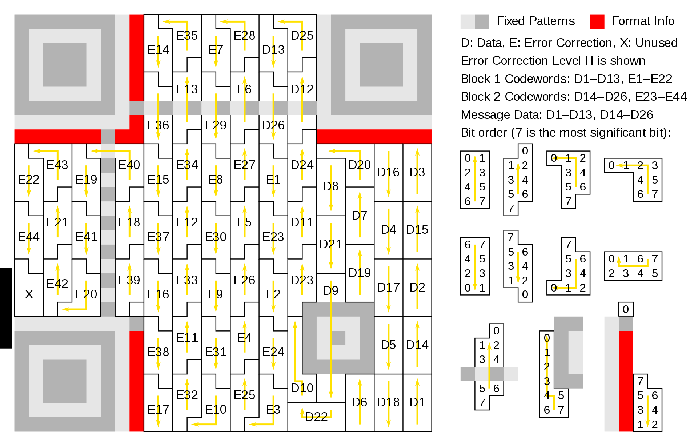

There can be additional fixed pattern depending on the **version** of the QR Code.

```text
size = version * 4 + 17
```

Our QR Code is 41x41, so it is **version 6**.

Fortunately, QR Codes before version 7 only have **one alignment pattern** and **no version indicator block**, which will make things easier.

Based on the above diagram, we will generate a 41x41 layer for our fixed patterns that should **never be masked**.

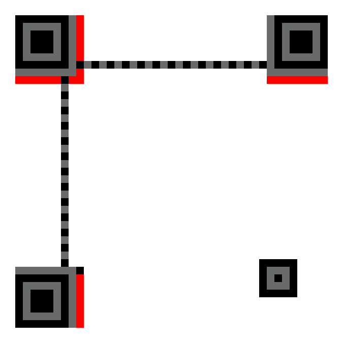

Make sure to scale it to the same size as our QR, and add borders to simplify the operations between the images.

There is a simple [Python script](scripts/mask.py) that will generate the custom mask pattern, and XOR our QR Code with the mask while making sure to keep fixed pattern unmasked.

The generated custom mask looks like this :

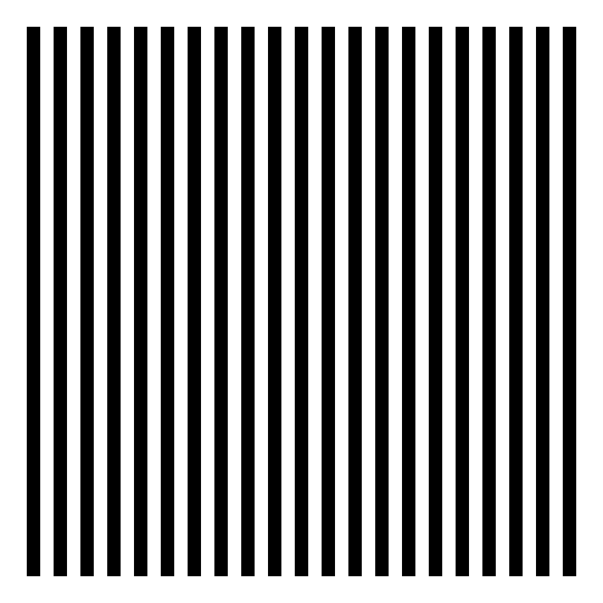

After applying (**=removing**) the mask with this script, we get the **"raw" QR Code** :

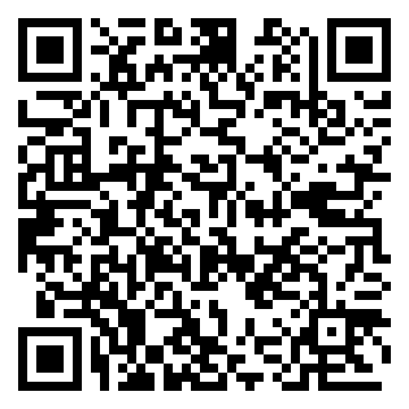

This QR Code will not be recognized by any readers, because they expect **one of the 8 existing masks** to be applied.

So first we have to apply one of the classic masks to our QR to make it readable by most readers.

To do so, we can use the tool [QRazyBox](https://merri.cx/qrazybox/).
This tool allows us to import QR Codes, edit them, or draw them pixel by pixel.

We simply create a `New project -> Import from Image`, select the raw QR Code, and click on `Tools -> Data Masking -> <Select any mask> -> Apply`.

This is what it looks like after applying mask n°4 :

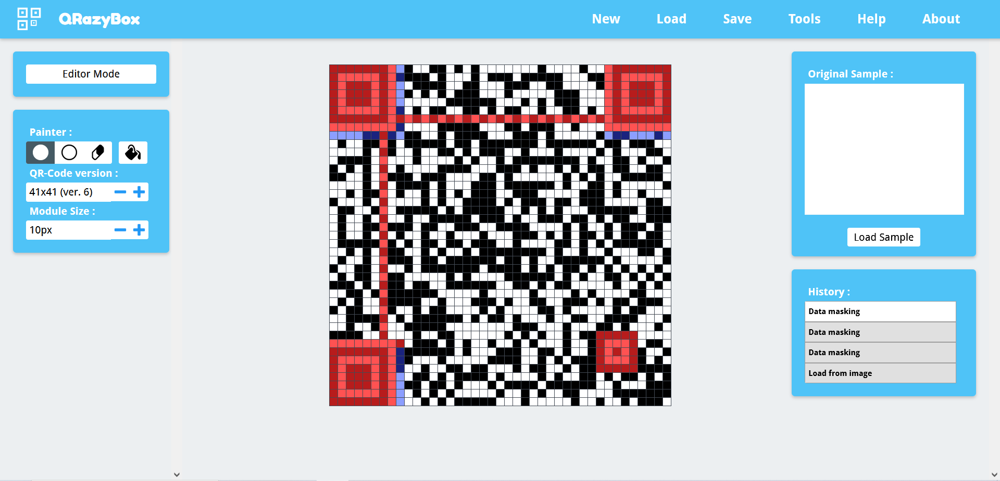

Now we will use the `Tools -> Extract Information` option, and we finally get some... non-sense string ?

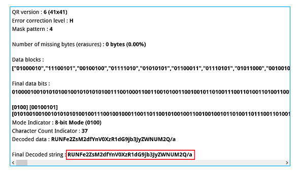

```text
Final Decoded string : RUNFe2ZsM2dfYnV0XzR1dG9jb3JyZWNUM2Q/a
```

Paste it into [CyberChef](https://gchq.github.io/CyberChef/) and.... we get an interesting string from Base64 !

```text
ECE{fl3g_but_4utocorrecT3d?
```

However this does not look like a valid flag, since the placeholder should be `ECW` and the `3` does not belong in `fl3g`...

## Error code correction correction

**Rule n°2** is pretty explicit that you can't trust the "correction" and should only trust your "own" answers :

```text
[He uses] an "AI" that would always correct my valid answers by some non-sense...
```

This is a reference to QR Codes **error correction codes**.

QR Codes use `Red-Solomon code` for error correction, which helps to make the embedded message readable even if a part of the data goes missing.

We can guess that in our case the error correction **overwrites the real data**, hiding the flag.

Based on the [same diagram as before](#fixed-patterns), we can see that error correction codewords `E1, E2, ..., E44` are appended **after the data codewords**.

These error correction pixels can correct up to ±60% of errors in the best scenario, which can completely change the content of our flag.

However if we **remove enough** of the error correction codewords, the message will **not be corrected** and we will retrieve its original content.

We can use `QRazyBox` to make it work.

Using the `eraser` tool, we can replace error correction pixels by grey pixels, which will be treated as **missing/unknown data**.

We will use [this table](https://www.thonky.com/qr-code-tutorial/error-correction-table) to determine the total number of error codewords.

For a **Version 6** QR Code using **High** Error Correction Code, we can see that the last **102 codewords** (`28* 4 blocks`) should be error correction codewords.

Grey out approximately 102 error codewords :

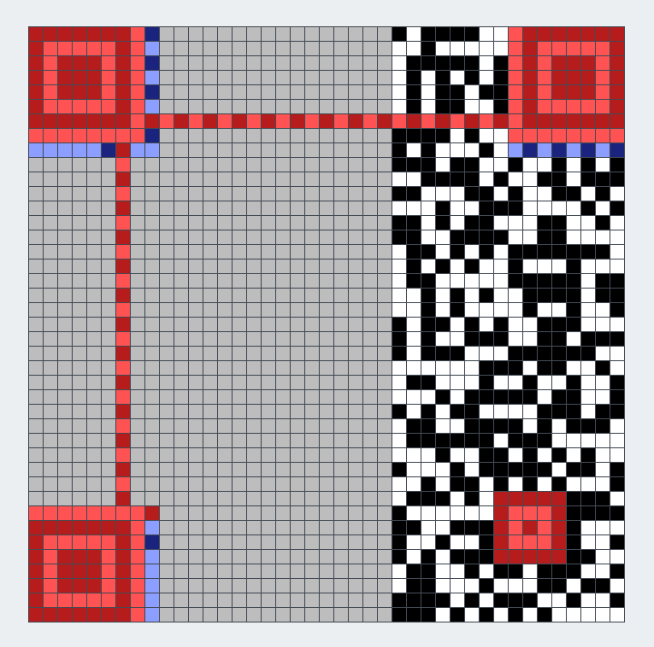

_NOTE : You don't need to grey out all 102 error codewords for the correction to be removed. Erasing ~30% of the total error codewords should be enough to neglect error correction._

Now when extracting the QR Code information with `Tools -> Extract Information`, it will correctly ignore error correction and a will reveal a totally different message :

```text
RUNXe2ZsNGdfYnV0X25vdF9jb21wbGVUM19va
```

_NOTE : Temporarily remove the additional character `'a'` to have a multiple of 4 characters._

```bash
$ echo -n RUNXe2ZsNGdfYnV0X25vdF9jb21wbGVUM19v | base64 -d

# ECW{fl4g_but_not_compleT3_o
```

It seems like this is the correct flag, however it is incomplete !

What is missing here ?

### Look for hidden message presence

QRCodes have many versions, based on their size.
Each version can store a **fixed amount** of data.

We need to check the maximum capacity of our QR Code version and compare to the actual data size.

Using the `Extract QR Information` tool from QRazyBox, our QR has the following metadata :

- Encoding : Byte
- Character count : 37
- Error correction level : H(igh)

Based on the [Character capacities table](https://www.thonky.com/qr-code-tutorial/character-capacities), it can store **58 characters**.

However, our current flag only has **37 characters**. There is definitely room for an **hidden message** in there.

### Where is my pudding ?

**Rule n°3:**

```text
[He would always] hide easter eggs at the very end of my papers, students finding them would get some pudding as a reward !
```

As stated earlier, each QR Code version can store a **fixed amount** of data. If your message does not fit the maximum capacity of this QRCode version, it will be **padded** with an alternating two bytes pattern :

```text
11101100 00010001
```

This is explained in details [here](https://www.thonky.com/qr-code-tutorial/data-encoding), section `Step 4: Break Up into 8-bit Codewords and Add Pad Bytes if Necessary`.

It becomes clear that the "pudding" is a reference to this **padding**.

How is that useful ?

Well, padding bytes are not part of the data, thus QR Code readers will **not show them** when reading your QR Code. Padding bytes are theoretically not mandatory, some scanners don't even check them.

To know where the real message ends and the padding begins, there is an "End Of File" marker : `0b0000`.

Since padding bytes are most of the time not verified, you can use them as a **data information vessel**.
Combined with an **early EOF pattern**, you can hide secret data there from most QR readers.

Now, how can we find and extract the secret padding ?

We can look at the data codewords that `QRazyBox` already extracted for us, and find the `EOF marker`. The following bytes will be the padding.

Codewords contain the original unmasked data bits, however **they can't just be read in the given order**.

During data embedding in certain QR versions, codewords are **interleaved**. This means that two adjacent characters of the original message will not necessarily be stored in consecutive codewords.

The protocol of interleaving depends on the QR Code version and its Error Correction Level.

This is an example of interleaving for a version 3 QR Code :


The expected order should be `D1, D2, D3, ..., D26`.

But the reading order is `D1, D14, D2, D15, ..., D26` actually after interleaving.

When QRazyBox extracts codewords (these are called "data blocks" in the app), they are in reading order.

We will have to **take the interleaving into account** if we don't want the bytes of our flag to be scrambled.

Let's recap :

- QR Version : 6 (41x41 pixels)
- Error Correction Level : H(igh)
- Codeblocks : {from QRazyBox}

The [following script](scripts/eof.py) will take a **list of codewords** extracted from QRazyBox, the QR Code **version** and **EC level**, and will extract the hidden message based on the correct interleaving protocol.

Codewords can be found in the `Data blocks` section of the `Tools -> Extract QR Information` panel.

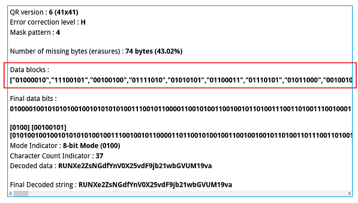

Change the parameters if necessary :

```python
CODEWORDS = <your_codewords>
VERSION = 6
ECLVL = 'H'
```

Run the script :

```bash
$ python padding.py

# Output :
# ECW{fl4g_but_not_compleT3_oh_H3r3_iT_1s!}
```

Well played !

## QRazyBox is the way

As a **TL;DR** I would like to propose a full solution that is **way faster**.

I wanted this write-up to be beginner friendly and guide readers to a better understanding of QRCodes.

However, if you know what you are doing this challenge can be solved way faster using the full potential of QRazyBox.

### Custom mask hijacking

First, we will clone [QRazyBox repository](https://github.com/Merricx/qrazybox) and patch it locally to add support for our custom mask.

We will **override mask n°5** to actually apply our **custom mask** function.

_Q : Why mask n°5 ?_

_A : Because it is the one corresponding to mask marker `0b000` in QRazyBox, and the tool will automatically convert our grey format bits to white during import. Thus, the default format bits for the mask will be `0b000`._

Remember our custom mask can be expressed as `(j % 2) == 0`.

Patching mask n°5 :

```diff
--- qrazybox/js/sqrd.js

    if(pat == 0b101)
-       return (i * j) % 2 + (i * j) % 3 == 0;
+       return j % 2 == 0;
```

```diff
--- qrazybox/js/jsqrcode/datamask.js

    this.isMasked=function( i,  j)
    {
        var temp = i * j;
-       return (temp & 0x01) + (temp % 3) == 0;
+       return (j & 0x01) == 0;
    }
```

Simply open `index.html` in any browser to deploy your local `QRazyBox` instance.

Now the app will automatically be able to handle our custom mask when doing mask operations.

Import the given QR Code with `New Project -> Import from Image`.

After import, click on any blue pixel in the top left corner format bits, this should display mask n°5.

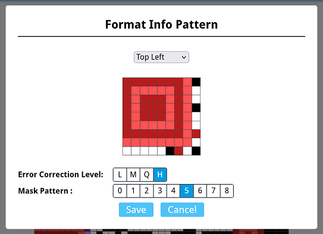

Finally, click on `Tools -> Extract QR Information`.

The `Final Decoded string` should be a `base64` encoded string :

_NOTE : Temporarily remove the additional character `'a'` to have a multiple of 4 characters._

```bash
$ echo -n RUNFe2ZsM2dfYnV0XzR1dG9jb3JyZWNUM2Q/ | base64 -d

# ECE{fl3g_but_4utocorrecT3d?
```

### Error correction ? What for

We know that error correction codewords are always added after the data chunks, which means they always are **at the end** of the QR Code.

Now through trial and error, we can simply **erase pixels** (replace with grey) from the end of the QRCode, following the "zigzag" reading order of the QRCode.
After a while, we will reach the threshold where missing data can **not be recovered anymore**.

Using `Tools -> Extract QR Information` will reveal the original non-corrected message.

This step is pretty much similar to [what we did](#error-code-correction-correction) for the detailed version earlier.

We get the following message :

```text
RUNXe2ZsNGdfYnV0X25vdF9jb21wbGVUM19va
```

Decoding from `base64` gives this partial flag :

_NOTE : Temporarily remove the additional character `'a'` to have a multiple of 4 characters._

```bash
$ echo -n RUNXe2ZsNGdfYnV0X25vdF9jb21wbGVUM19v | base64 -d

# ECW{fl4g_but_not_compleT3_o
```

### Badboys vs Padboys  

To reveal the hidden message stored in padding we will use the `Padding Bits Recovery` tool from QRazyBox.

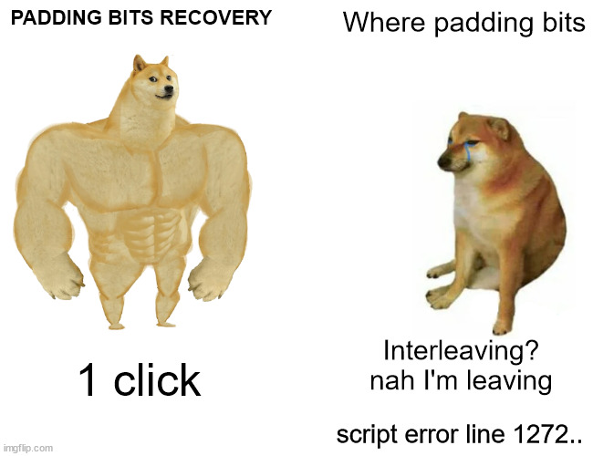

In QRazyBox click on `Tools -> Padding Bits Recovery`.


This feature is usually used to repair missing or corrupted padding bytes, so that QR readers can correctly scan the QR.

However, the trick is that `QRazyBox` will show you the padding bits **before** and after recovery, **taking interleaving into account**.

This means we only have to convert the binary stream **before recovery** to ASCII to reveal the hidden message.

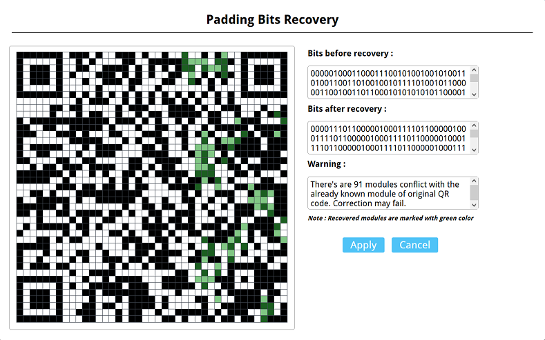

```text
Bits before recovery :

0000010001100011100101001001010011010011001101001001011110100101100000110010011011000101010101011000011110100100011001111010010010010101100000110000001111011110110000010001
```

Don't forget to remove the `0b0000` marker at the beginning, and we can successfully read the hidden message :

```text
F9IM3IzX2lUXzFzIX0=
```

Combine the two flag parts :

```bash
$ echo -n RUNXe2ZsNGdfYnV0X25vdF9jb21wbGVUM19vaF9IM3IzX2lUXzFzIX0= | base64 -d

# ECW{fl4g_but_not_compleT3_oh_H3r3_iT_1s!}
```

## Sources

- [thonky.com - QR Code tutorial](https://www.thonky.com/qr-code-tutorial/)
- [wikipedia.org - QR Code](https://fr.wikipedia.org/wiki/Code_QR)
