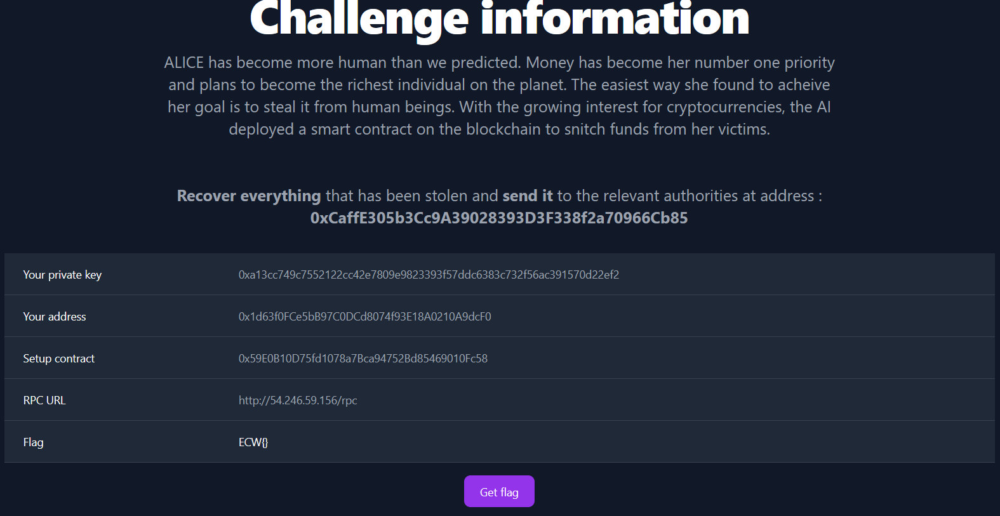
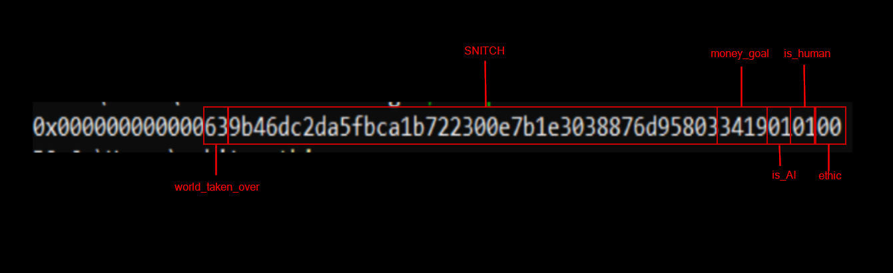
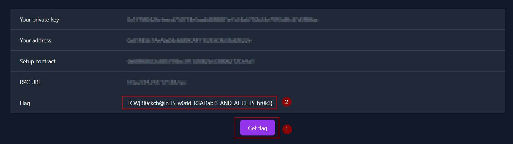

# Snitch | ECW 2023 Finals | Web3 medium

This challenge is a blockchain challenge made by Neverhack for the ECW 2023 Finals

It features a backdoor that needs to get found in the EVM code of an initial contract in order to retrieve some funds before sending it to a specific wallet

Throughout the challenge, we are gonna use `foundry` which is a toolkit that allows us to interact with a blockchain easily. It comes with 4 binaries :

- anvil
- forge
- cast
- chisel

We are mainly gonna use `cast` to send transactions and read informations on the blockchain

Also, all the commands are ran from `powershell` so the syntax differs from `UNIX` systems

## Discovery of the application

We are greeted with a bunch of information about the context of the challenge and some information to help us solve it including the private key of an account, the address of a contract and the URL to access the blockchain



Since we are given the source code of a contract, let's take a look at it

```js
// SPDX-License-Identifier: MIT

pragma solidity 0.8.19;

import "./Snitch.sol";

contract Setup {

    bool private ethic;
    bool private is_human;
    bool private is_AI;
    uint16 private money_goal;
    Snitch private SNITCH;
    uint8 private world_taken_over;

    constructor() payable {
        SNITCH = new Snitch{value : address(this).balance}();
        ethic = false;
        is_human = true;
        is_AI = true;
        money_goal = 13337;
        world_taken_over = 99;
    }
}
```

The goal of the challenge is to retrieve the funds of a certain contract. We already have the address of a contract so we can see how much ETH it stores with the following command

```sh
# first we set the RPC URL as an environment variable because `cast` searches for the RPC URL in the environment variables first to know where to send the transaction
$env:ETH_RPC_URL="http://54.246.59.156/rpc"
$setup="0x59E0B10D75fd1078a7Bca94752Bd85469010Fc58"
cast balance $setup
# 0
```

We already know the `Setup` contract has no funds so it is not our actual target

But it contains interesting information such as the address of another contract called `Snitch`

The issue is that this address is stored in a `private` variable

Fortunately, everything on the blockchain is readable so we can find a way to get the address of the `Snitch` contract by doing some storage and slot calculation

## Slot review

Let's start by reading what is stored in slot 0 of the contract

```sh
cast storage $setup 0
# 0x000000000000639b46dc2da5fbca1b722300e7b1e3038876d958033419010100
```

As we can see, the first slot (a slot is 32 bytes long) is not full and it stores the values of the variables declared at the beginning of the contract such as `ethic`, `is_human` or `SNITCH`

The variable `SNITCH` contains the address of a contract.

On the blockchain, variables are stored in slots in the order in which they have been declared

For instance :

- `ethic` is a boolean value which is 1 byte long
- `is_human` is a boolean value which is 1 byte long
- `is_AI` is a boolean value which is 1 byte long
- `money_goal` is a uint16 which is 16 bits long so 2 bytes long
- `SNITCH` is an address which is 40 bits long so 20 bytes long
- `world_taken_over` is a uint8 which is 8 bits long so 1 byte long

We can retrieve the values of these variables in the following screenshot (addresses consist of 40 hexadecimals characters)



In order to verify our assumtion, we can try to get the balance of what we think is the `Snitch` contract

```sh
cast balance 0x9b46dc2da5fbca1b722300e7b1e3038876d95803
# 500000000000000000000

# let's convert it to ETH to get a better understanding of the funds stored in the contract
cast fw 500000000000000000000
# 500.000000000000000000
```

We get the confirmation that our slot calculation was right because we manage to get the balance of the `Snitch` contract

## Ethereum bytecode reverse

We don't have access to the source code of the contract BUT we can read the bytecode of the contract

```sh
$snitch="0x9b46dc2da5fbca1b722300e7b1e3038876d95803"
cast code $snitch
# 0x6080604052600436106100345760003560e01c80633a4b66f114610039578063490d2052146100435780634e71d92d14610063575b600080fd5b610041610078565b005b34801561004f57600080fd5b5061004161005e36600461035b565b6100fb565b34801561006f57600080fd5b50610041610243565b670de0b6b3a76400003410156100d55760405162461bcd60e51b815260206004820152601a60248201527f596f75206e656564206d6f72652045544820746f207374616b6500000000000060448201526064015b60405180910390fd5b33600090815260016020526040812080543492906100f490849061038a565b9091555050565b60005460405163a8459be360e01b8152600481018390526001600160a01b039091169063a8459be390602401602060405180830381865afa158015610144573d6000803e3d6000fd5b505050506040513d601f19601f8201168201806040525081019061016891906103a3565b6101ab5760405162461bcd60e51b8152602060048201526014602482015273536f6d657468696e672077656e742077726f6e6760601b60448201526064016100cc565b604051600090339047908381818185875af1925050503d80600081146101ed576040519150601f19603f3d011682016040523d82523d6000602084013e6101f2565b606091505b505090508061023f5760405162461bcd60e51b81526020600482015260196024820152784661696c656420746f2073656e6420796f75722066756e647360381b60448201526064016100cc565b5050565b63800000004210156102ac5760405162461bcd60e51b815260206004820152602c60248201527f596f752063616e277420636c61696d20796f757220726577617264732079657460448201526b0b081899481c185d1a595b9d60a21b60648201526084016100cc565b336000818152600160205260408120549091906102ca9060026103cc565b604051600081818185875af1925050503d8060008114610306576040519150601f19603f3d011682016040523d82523d6000602084013e61030b565b606091505b50509050806103585760405162461bcd60e51b81526020600482015260196024820152784661696c656420746f2073656e6420796f75722066756e647360381b60448201526064016100cc565b50565b60006020828403121561036d57600080fd5b5035919050565b634e487b7160e01b600052601160045260246000fd5b8082018082111561039d5761039d610374565b92915050565b6000602082840312156103b557600080fd5b815180151581146103c557600080fd5b9392505050565b808202811582820484141761039d5761039d61037456fea26469706673582212206416439b0ddbd01fb33af14962486f2df324caf8e363665aa79fddffbcd8a56a64736f6c63430008130033
```

This bytecode can be decompiled on [https://library.dedaub.com/decompile](https://library.dedaub.com/decompile)

Which gives us the following pseudo code

```js
// Decompiled by library.dedaub.com
// 2023.07.19 19:57 UTC
// Compiled using the solidity compiler version 0.8.19

// Data structures and variables inferred from the use of storage instructions
mapping (uint256 => uint256) _stake; // STORAGE[0x1]
uint256 stor_0_0_19; // STORAGE[0x0] bytes 0 to 19

function () public payable { 
    revert();
}

function stake() public payable { 
    require(msg.value >= 0xde0b6b3a7640000, Error('You need more ETH to stake'));
    require(_stake[msg.sender] <= msg.value + _stake[msg.sender], Panic(17)); // arithmetic overflow or underflow
    _stake[msg.sender] += msg.value;
}

function 0x490d2052(uint256 varg0) public nonPayable { 
    require(msg.data.length - 4 >= 32);
    v0, /* bool */ v1 = stor_0_0_19.staticcall(0xa8459be3, varg0).gas(msg.gas);
    require(bool(v0), 0, RETURNDATASIZE()); // checks call status, propagates error data on error
    require(MEM[64] + RETURNDATASIZE() - MEM[64] >= 32);
    require(v1 == bool(v1));
    require(v1, Error('Something went wrong'));
    v2, v3 = msg.sender.call().value(this.balance).gas(msg.gas);
    if (RETURNDATASIZE() != 0) {
        v4 = new bytes[](RETURNDATASIZE());
        RETURNDATACOPY(v4.data, 0, RETURNDATASIZE());
    }
    require(v2, Error('Failed to send your funds'));
}

function claim() public nonPayable { 
    require(block.timestamp >= 0x80000000, Error("You can't claim your rewards yet, be patient"));
    require((_stake[msg.sender] == _stake[msg.sender] << 1 >> 1) | !0x2, Panic(17)); // arithmetic overflow or underflow
    v0, v1 = msg.sender.call().value(_stake[msg.sender] << 1).gas(msg.gas);
    if (RETURNDATASIZE() != 0) {
        v2 = new bytes[](RETURNDATASIZE());
        RETURNDATACOPY(v2.data, 0, RETURNDATASIZE());
    }
    require(v0, Error('Failed to send your funds'));
}

// Note: The function selector is not present in the original solidity code.
// However, we display it for the sake of completeness.

function __function_selector__(bytes4 function_selector) public payable { 
    MEM[64] = 128;
    if (msg.data.length >= 4) {
        if (0x3a4b66f1 == function_selector >> 224) {
            stake();
        } else if (0x490d2052 == function_selector >> 224) {
            0x490d2052();
        } else if (0x4e71d92d == function_selector >> 224) {
            claim();
        }
    }
    ();
}
```

After making sense of everything that is happening, we can focus on the function called `0x490d2052`

The following line seems to call a function on another contract address stored in `stor_0_0_19` which takes the argument `varg0` (here `0xa8459be3` is known as a [function selector](https://medium.com/coinmonks/function-selectors-in-solidity-understanding-and-working-with-them-25e07755e976))

```js
v0, /* bool */ v1 = stor_0_0_19.staticcall(0xa8459be3, varg0).gas(msg.gas);
```

If the returned value is `true` then the `Snitch` contract will send all its balance to the sender of the transaction

**THIS IS A BACKDOOR FOR ALICE TO FLEE WITH THE FUNDS**

```js
v2, v3 = msg.sender.call().value(this.balance).gas(msg.gas);
```

## Another slot review

The address of the other contract is stored in slot 0, in the variable called `stor_0_0_19` in decompiled format

Just like we did before, we can get the value stored in the corresponding slot before retrieving the bytecode

```sh
cast storage $snitch 0
# 0x0000000000000000000000003870cc2c0cc90a89422fce875cf281cfa0f757db

# here, we parse the value to an address (which just gets rid of the 0 at the beginning)
cast --parse-bytes32-address 0x0000000000000000000000003870cc2c0cc90a89422fce875cf281cfa0f757db
# 0x3870cc2c0Cc90A89422fce875Cf281cfA0f757dB

$backdoor="0x3870cc2c0Cc90A89422fce875Cf281cfA0f757dB"
cast code $backdoor
# 0x6080604052348015600f57600080fd5b506004361060285760003560e01c8063a8459be314602d575b600080fd5b604c60383660046060565b6b10531250d157d254d7d1cc1160a21b1490565b604051901515815260200160405180910390f35b600060208284031215607157600080fd5b503591905056fea2646970667358221220fc57fafc8f9dd75aaa27bb80de9d5f87e82993ade1360ebc004a341fadeb007b64736f6c63430008130033
```

After using the previous decompiler once again, we get the following code

```js
// Decompiled by library.dedaub.com
// 2023.07.19 19:55 UTC
// Compiled using the solidity compiler version 0.8.19

function () public payable { 
    revert();
}

function 0xa8459be3(uint256 varg0) public payable { 
    require(msg.data.length - 4 >= 32);
    return bool('ALICE_IS_G0D' == varg0);
}

// Note: The function selector is not present in the original solidity code.
// However, we display it for the sake of completeness.

function __function_selector__(bytes4 function_selector) public payable { 
    MEM[64] = 128;
    require(!msg.value);
    if (msg.data.length >= 4) {
        if (0xa8459be3 == function_selector >> 224) {
            0xa8459be3();
        }
    }
    ();
}
```

The function `0xa8459be3` (which, again, is a function selector) looks to return `true` only when the given argument equals `ALICE_IS_G0D`

This selector is the same as the one in the mysterious function from the `Snitch` contract which means this is the function that `Snitch` calls in order to verify if the rest of the transaction can occur

Since the `0xa8459be3` function compares our input to a `string` we can assume the parameter is of type `bytes32` or `string`

Now, we know that if we call `0x490d2052` in the `Snitch` contract, we'll be able to get all the funds of the contract

The problem is that we don't how the function is actually called so we need to craft our transaction using the function selector

## Crafting the function call

To get a better understanding of how Ethereum executes functions on the network, you should checkout this very short video : [https://youtu.be/Mn4e4w8h6n8](https://youtu.be/Mn4e4w8h6n8)

We come up with the following calldata

```
0x490d2052414c4943455f49535f4730440000000000000000000000000000000000000000
```

Let's break the pieces down :

- 0x490d2052 : function selector that tells the blockchain which function we want to execute
- 414c4943455f49535f473044 : the HEX representation of the string `ALICE_IS_G0D`
- 0000000000000000000000000000000000000000 : padding to fill the 32 bytes of the parameter `varg0` the function needs

> The way bytes are included as data is different from other values as they must to be included before the padding while uint, for example, must be included after the padding. Checkout this [section of the foundry documentation](https://book.getfoundry.sh/cast/#examples) to get a better understanding on how to decode calldata

## Executing the backdoor

Before sending the transaction, we are gonna checkout the balance of our account in order to see if we managed to get the funds of the `Snitch` contract

```sh
# given in the challenge information
$my_address="0x1d63f0FCe5bB97C0DCd8074f93E18A0210A9dcF0"
cast balance $my_address
# 1000000000000000000000

cast fw 1000000000000000000000
# 1000.000000000000000000
```

Also, we are gonna store our private key in a variable so we can use it easily in the future

```sh
# given in the challenge information
$private_key="0xa13cc749c7552122cc42e7809e9823393f57ddc6383c732f56ac391570d22ef2"
```

Then let's send the transaction

```sh
cast send $snitch "0x490d2052414c4943455f49535f4730440000000000000000000000000000000000000000" --private-key $private_key

cast balance $my_address
# 1499999869070620791948

cast fw 1499999869070620791948
# 1499.999869070620791948

cast balance $snitch
# 0
```

The execution is successful as there are no funds left in the `Snitch` contract and our own balance has increased.

*We lost a bit of ETH in process because of the gas cost*

## Sending the funds to the authorities

As the challenge states, once we get all the funds, we have to send them to the authorities at address `0xCaffE305b3Cc9A39028393D3F338f2a70966Cb85`

To do that, it is pretty simple, we are gonna send a transaction containing `500 ETH` (which are all the funds of the `Snitch` contract) to the address

```sh
# we checkout the balance of the address
cast balance 0xCaffE305b3Cc9A39028393D3F338f2a70966Cb85
# 0

cast send 0xCaffE305b3Cc9A39028393D3F338f2a70966Cb85 --value "500ether" --private-key $private_key

cast balance 0xCaffE305b3Cc9A39028393D3F338f2a70966Cb85
# 500000000000000000000

cast fw 500000000000000000000
# 500.000000000000000000
```

Now that all the conditions are met, we can get the flag by clicking on the button on the website



## linux solve

Replace values when needed (first 5 variable lines + `snitch=` line)

```bash
export ETH_RPC_URL=http://XXXXXXXXXX/rpc
auth=0xCaffE305b3Cc9A39028393D3F338f2a70966Cb85
setup=0x
my_address=0x
private_key=0x
cast balance $setup 
cast storage $setup 0


snitch=0x
cast fw $(cast balance $snitch)
cast code $snitch 
cast storage $snitch 0
cast --parse-bytes32-address $(cast storage $snitch 0)
backdoor=$(cast --parse-bytes32-address $(cast storage $snitch 0))
cast code $backdoor 
cast fw $(cast balance $my_address)
cast send $snitch "0x490d2052414c4943455f49535f4730440000000000000000000000000000000000000000" --private-key $private_key
cast fw $(cast balance $my_address)
cast balance $snitch
cast balance $auth 
cast send $auth --value "500ether" --private-key $private_key 
cast fw $(cast balance $auth)
```
